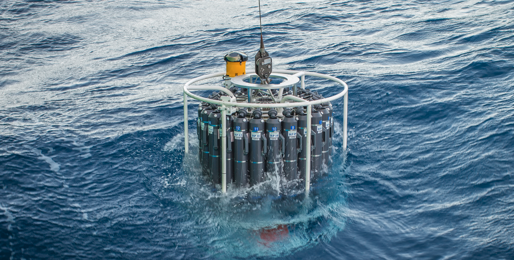

|[Home](./index.html) |[Research](./research.html)          | [Publications](./publications.html)            | [Teaching](./teaching.html)   |  [Outreach](./outreach.html)         | [CV](./vita.html)     |

_A carousel of Niskin bottles and sensors (including conductivity, temperature, pressure, light, etc.) is immersed in the ocean. This kit is then lowered down the deep ocean where some bottles are triggered from the surface to close and trap the water typical from the wanted depth. On the way up, we stop several times to collect water at different depths, while the sensors constantly collect data during both descent and ascent. Photo snapped by Gloria Salgado Gispert during the SOTS/EDDY voyage in 2016._

Videos
==========================
A great introduction to the NAAMES project I've been part of can be found in the work of Nicole Estaphan and Lee Harrington. Some mini-documentaries can be found [here](https://www.youtube.com/watch?v=Fp3bNkXzbLI), [here](https://www.youtube.com/watch?v=YKbHJHfChSw), [here](https://www.youtube.com/watch?v=gUUoa9JgujE), and [here](https://www.youtube.com/watch?v=O5QAg8L_xNM).

Blog posts
==========================

[Wake up calls _from the S285 SEA blog_](https://www.sea.edu/sea_currents/robert_c_seamans/wake-ups)

[What do you see when you go on a research cruise? - _from the NAAMES4 blog_](https://earthobservatory.nasa.gov/blogs/fromthefield/2018/04/06/naames-iv-expedition-april-5-2018/)

[Adventures in the mesopelagic - _from the NAAMES3 blog_](https://earthobservatory.nasa.gov/blogs/fromthefield/2017/09/15/8854/)

