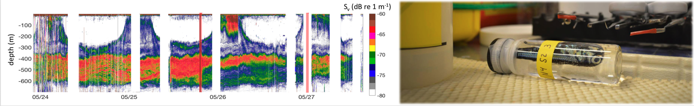
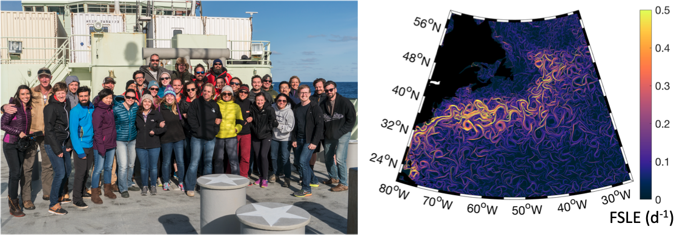
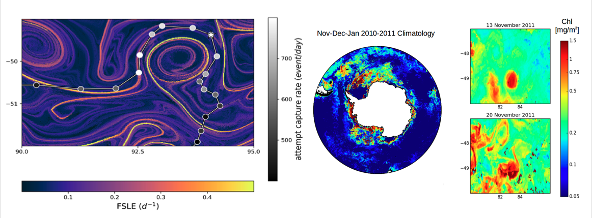

|[Home](./index.html) |[Research](./research.html)          | [Publications](./publications.html)            | [Teaching](./teaching.html)   |  [Outreach](./outreach.html)         | [CV](./vita.html)     |

My research revolves around five themes that are related in their aim of understanding how marine ecosystems are affected by currents and patterns in physical properties. These themes are:
1. impact of eddies and fronts on the distribution of phytoplankton; 
2. zooplankton grazing in a flowing environment; 
3. effects of currents and current-patterns on large pelagic predators; 
4. effects of fine scale dynamics on optical properties of coastal waters;
5. fine scale drivers of spatial and temporal variability of micronekton.

**Current projects**
==========================

### The Impact of a Southern Ocean Eddy on mesopelagic micronekton 

Mesoscale eddies are rotating currents that are ubiquitous in the ocean. They are the oceanic equivalent of weather patterns and have typically radii of 10-100 km and lifetimes between weeks and months. Mesoscale eddies have a dramatic impact on the distribution of primary production in the open ocean, on the transport of heat and salt across oceanic regions, on global biogeochemical cycles, and on the feeding behavior of apex predators such as pinnipeds, sharks, billfishes, and seabirds. In this study, we aim to evaluate the impact of a Southern Ocean mesoscale eddy on the distribution of deep water micronekton, a diverse group of small animals including fish, crustacea, and squids. Our results suggest that the abundance and vertical distribution of deep water micronekton, detected using a sonar, inside the sampled mesoscale eddy differed from those of the surrounding waters. Micronekton distribution and abundance were instead more similar to those of the locations where the eddy had originated a month prior to our sampling. Our results suggest that mesoscale eddies can maintain their biological characteristics from its source waters creating a unique habitat compared to its surrounding waters.

_Example of an echogram collected in the Southern Ocean. This time-series starts from the center of a Southern Ocean cyclonic eddy. The RV Investigator eventually left the eddy core and moved into the eddy periphery and ambient waters of the Sub-Antarctic Zones that were characterised by a different vertical distribution of acoustic backcscattering._

**Past projects**
==========================

### MEchanisms of Coupling of Ocean Dynamics and Intermediate trophic levels: High Resolution study (MECODIHR)

The open ocean is the largest biome on Earth, yet it is the least protected. A major obstacle to its conservation lies in the fine-grained understanding of how marine organisms are affected by the ocean dynamics. In the last decades, remote sensing and bio-logging drastically increased our understanding to how phytoplankton (that can be observed from space as ocean color) and large marine animals (that can be followed with sensors directly attached to them) responds to oceanic turbulence down to the mesoscale (few weeks-months, 10-100 km). A major knowledge gap still concerns the so-called "intermediate trophic levels" (ITLs, i.e. zooplankton and micronekton,) and how mesoscale currents (such as fronts and eddies) affect them. In this project, funded by the European Commission, **[Peter Gaube (APL-UW)](https://submesoscale.org/)**, **[Pascal Rivière (LEMAR-UBO)](https://www-iuem.univ-brest.fr/lemar/equipe/riviere_pascal/?lang=en)** and I aim at understanding how eddies and fronts affect the distribution of micronekton and zooplankton. This project has received funding from the European Union’s Horizon 2020 research and innovation programme under the Marie Sklodowska-Curie grant agreement No 749591.

_Example of an echogram collected in the North Atlantic. Different colors indicate differences in the intensity of sound reflected by organisms such as zooplankton and micronketon near the surface and in deep scattering layers (~ 400 m). This echogram was collected during transit from an eddy core (left side of the plot) through the periphery and then out in ambient waters. On the right, example of myctophid (lanternfish) collected during a mid-water trawl._

### North Atlantic Aerosols and Marine Ecosystems Study (NAAMES)
The **[North Atlantic Aerosols and Marine Ecosystems Study](https://naames.larc.nasa.gov/)** (NAAMES, P.I. Michael J. Behrenfeld) is an interdisciplinary effort to characterize plankton ecosystem properties through the annual cycle and determine how remote marine aerosols and boundary layer clouds are influenced by marine ecosystems, especially by phytoplankton. This study was carried out in the nortwestern Atlantic, a region characterized by intense mesoscale and submesoscale variability that has been observed to affect phytoplankton abundance, phenology and community composition. My role in this project, with **[Peter Gaube (APL-UW)](https://submesoscale.org/)** has been to help designing a sampling strategy to target mesoscale features having different polarities (i.e., cyclones and anticyclones) and retentive properties as well as interpreting specific patterns in phytoplankton abundance and community composition in respect to the spatial distribution of fronts and eddies. Peter and I have also used the opportunity to be onboard the R/V Atlantis to collect acoustic and net samples to understand how eddies and fronts affect the distribution of fish and zooplankton (see MECODIHR project).

_Group picture from the 4th (and last) NAAMES field trip to the North Atlantic (March 2018). On the right, map of Finite Size Lyapunov Exponents (FSLE) for the North Atlantic. High values of FSLE highlights the locations of fronts, meanders and eddy peripheries, such as the ones triggered by the Gulf Stream along the east coast of the USA._

### Living in a fluid-dynamical landscape: how do marine predators respond to turbulence? 
Marine top predators play a fundamental role in maintaining the structure and functioning of healthy marine ecosystems. In the last decades, the development of bio-logging (i. e. the deployment of autonomous recording tags on free-living animals) has radically changed the study of top predators and their interactions with their environment. Combinations of sensors measuring position (Argos and GPS), environmental properties (water temperature, light) and proxies for foraging behavior (accelerometers) have enabled relating migrations of large fish, marine mammals, sea turtles and seabirds to basin scale patterns of ocean currents, temperature, and productivity. However, what influences marine predators' movement at smaller spatial and temporal scales, such as the ones they experience during their foraging trips, is still largely unknown. This project, focused on the sub-Antarctic region around the Kerguelen Plateau, analyzed the interaction between marine top predators (elephant seals and macaroni penguins) and sub-mesoscale (few days-months, 10-100 km) ocean dynamics. This was achieved by combining in-situ observations, bio-logging data, remote-sensing, ecological modelling and a Lagrangian approach (i. e. based on the tracking of water parcels). 

_On the left, the trajectory of a southern elephant seal overlapped to a Finite Size Lyapunov Exponents map. High values of FSLE indicate the position of fronts and, in this case, of the circular currents delimiting the periphery of an eddy. The dots in different shades of gray represent the total number of times the tagged elephant seal accelerated to capture a prey (and are a measure of attempt capture rate) per each day along the trajectory. A main finding of my work was that in the proximity of fronts and eddies, southern elephant seals tend to forage more intensively and this has important consequences on their swimming behavior and possibly on how they exploit different regions of the ocean. On the right, maps of near-surface chlorophyll measured from satellites. The zoomed maps on the right highlight that the spatial distribution of chlorophyll varies rapidly with time and that the patchiness at the mesoscale can present gradients of the same order of magnitudes as the ones we encounter over entire ocean basins._

